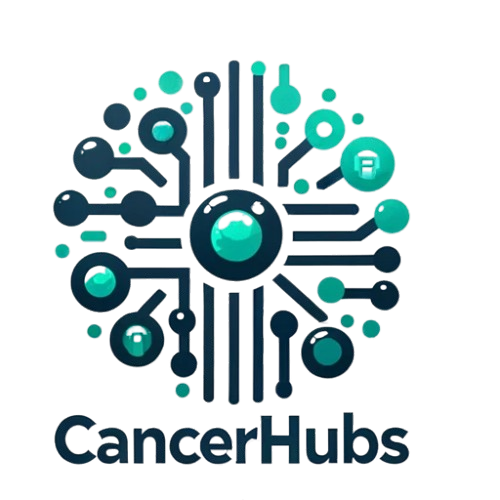

# CancerHubs Data Explorer

Welcome to the **CancerHubs Data Explorer**!  
This Shiny application provides an interactive interface for exploring results from the [CancerHubs project](https://github.com/ingmbioinfo/cancerhubs), including ranked gene data across tumour types, network visualisations, and shared hubs.

🧪 **Live App**: [https://cancerhubs.app/](https://cancerhubs.app/)  
📦 **Cancerhubs Main Repository**: [https://github.com/ingmbioinfo/cancerhubs](https://github.com/ingmbioinfo/cancerhubs)

---

## 🔍 Features

- **View Dataframes**  
  Explore pre-processed gene tables for each tumour type. Choose between _All Genes_, _PRECOG_, _Only Mutated_, and _Only PRECOG_ subsets. Download filtered data as Excel.

- **Gene Ranking Analysis**
  Input a gene symbol to check its rank across cancers based on **Network Score**. Visualise and download the results, including a pan-cancer positioning plot.

- **Common Genes Explorer**  
  Identify genes that consistently rank in the top N positions across multiple tumours. View results in a dynamic heatmap and export them.

- **Network Plot (3D)**  
  Visualise a 3D network of the top-scoring genes in a tumour dataset. Interactions are mapped based on known BioGRID interactions. Node colour, shape, and size encode multiple annotations.

- **Gene-Centric Network (2D)**  
  Explore direct interactors of any gene of interest. Visualise up to 50 interactors with igraph-style layout and download both the network image and tables.

---

## 🛠️ Prerequisites

To run this app locally, ensure you have:

- **R** (≥ 4.0.0)
- These R packages:
  ```r
  install.packages(c(
    "shiny", "ggplot2", "openxlsx", "DT", "plotly",
    "igraph", "RColorBrewer", "cowplot", "purrr",
    "dplyr", "tidyr", "shinycssloaders"
  ))
  ```

---

## 💾 Installation

1. **Clone the repository**:
   ```bash
   git clone https://github.com/ingmbioinfo/cancerhubs_shiny.git
   ```

2. **Run the App**:
   Open R or RStudio and run:
   ```r
   library(shiny)
   runApp("path/to/cancerhubs_shiny")
   ```

---

## 🌐 Online Access

You can use the app directly online without installation:  
👉 [https://cancerhubs.app/](https://cancerhubs.app/)

---

## 🧬 Data

All gene tables and interaction datasets are loaded dynamically from the original CancerHubs repository:

- [`all_results.rds`](https://github.com/ingmbioinfo/cancerhubs/blob/main/result/all_results.rds)
- [`genes_interactors_list.rds`](https://github.com/ingmbioinfo/cancerhubs/blob/main/result/genes_interactors_list.rds)
- [`biogrid_interactors`](https://github.com/ingmbioinfo/cancerhubs/blob/main/data/biogrid_interactors)

---

## 🙋‍♀️ Contact

For questions or support, contact:

- Nicola Manfrini – `manfrini@ingm.org`
- Ivan Ferrari – `ferrari@ingm.org`
- Elisa Arsuffi – `arsuffi@ingm.org`

---

## 📖 Citation

If you use CancerHubs in your research, please cite:

> Ivan Ferrari, Federica De Grossi, Giancarlo Lai, Stefania Oliveto, Giorgia Deroma, Stefano Biffo, Nicola Manfrini.  
> **CancerHubs: a systematic data mining and elaboration approach for identifying novel cancer-related protein interaction hubs**.  
> _Briefings in Bioinformatics_, Volume 26, Issue 1, January 2025.  
> [https://doi.org/10.1093/bib/bbae635](https://doi.org/10.1093/bib/bbae635)

---

## 📜 License

MIT License.  
© 2024 Istituto Nazionale di Genetica Molecolare (INGM).

---

## 💸 Funding

This research was funded by the **Associazione Italiana per la Ricerca sul Cancro (AIRC)**, under **MFAG 2021 ID 26178** project to **Nicola Manfrini**.
