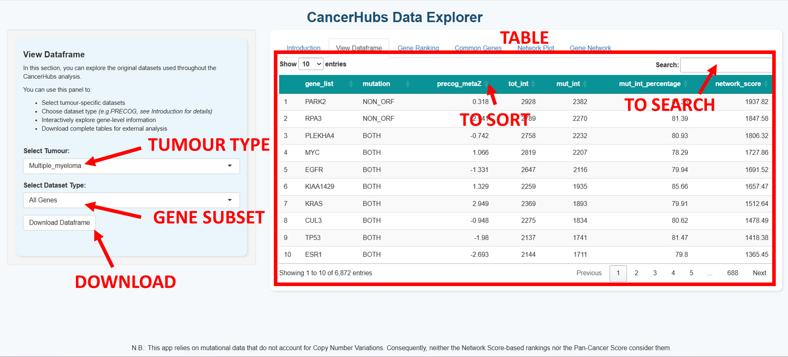

# CancerHubs Data Explorer User Manual

This guide provides a walkthrough for using the **CancerHubs Data Explorer** online. It explains how to navigate each tab of the web interface and retrieve data and images generated by the app.

---

## 1. Overview

The **CancerHubs Data Explorer** is an interactive web application for exploring pre-computed data from the *CancerHubs* project—a computational framework designed to predict proteins and pathways involved in cancer.

By integrating **mutational**, **interactomic**, and **expression–prognosis correlation** data, this method ranks genes based on a **Network Score**, which reflects the number of direct interactors mutated in each tumour type. This scoring defines **hubs of mutated proteins** with potential relevance for cancer research and therapy.

### Key Features:

- **Ranking genes across tumour types**
- **Visualising gene interaction networks**
- **Exporting processed data tables**

## 2. Accessing the App

The CancerHubs Data Explorer is available online—no installation is necessary. Simply visit:

<https://cancerhubs.app/>

All necessary data and packages are loaded automatically upon opening the website.

## 3. Application Layout

The interface is divided into a sidebar (left) and a main panel (right).

- **Sidebar** – Provides navigation and filtering options for each feature.
- **Main Panel** – Displays tables, plots, and network visualisations.
- **Tabs across the top** – Allow you to switch between the main functions: View Dataframe, Gene Ranking, Common Genes, Network Plot (3D), and Gene Network (2D).

## 4. Gene Subsets

Throughout the application, you can filter results based on predefined gene categories:

- **All Genes** – The entire set of genes scored by the CancerHubs framework, regardless of mutation status or external annotation.
- **PRECOG** – Genes annotated by the [PRECOG](https://precog.stanford.edu/) database, indicating significant prognostic associations.
- **Only Mutated** – Genes found mutated in the selected tumour dataset, excluding PRECOG genes.
- **Only PRECOG** – Genes with significant PRECOG metaZ scores that are not mutated in the dataset.

## 5. Features

### 5.1 View Dataframe

This panel allows you to explore the original datasets used throughout the CancerHubs analysis.

You can:

1. Select a tumour type from the dropdown menu.
2. Choose a **Gene Subset** (see above) to focus on a specific group of genes.
3. Explore the table by searching or sorting any column.
4. Use **Download Dataframe** to export the visible table as XLSX or CSV.

### 5.2 Gene Ranking

This panel allows you to investigate the rank of any gene of interest across all tumour types available in the CancerHubs dataset.

Each gene is ranked within each tumour type according to its Network Score, reflecting how central and biologically relevant it is, based on its interactions with other genes in that specific dataset.

You can:

1. Enter a gene symbol in the input box.
2. Choose the **Gene Subset** for ranking (All Genes, PRECOG, Only Mutated, or Only PRECOG).
3. View the rank bar plot and an interactive table with the gene's scores across tumour types.
4. Use the buttons to download the plot, the ranking table, or the overall pan-cancer ranking.

### 5.3 Common Genes

This panel helps identify genes that are ranked among the most relevant (Top), based on their Network Score, across multiple tumour types.

You can:

1. Select a **Gene Subset** and specify how many top genes to extract from each tumour type.
2. Set the minimum number of tumour types in which a gene must appear.
3. View the interactive heatmap showing presence across tumour types.
4. Download the resulting table for offline analysis.

### 5.4 Network Plot (3D)

This panel displays an interactive 3D network of the top-ranking genes (based on Network Score) for a selected tumour type.

You can:

1. Choose a tumour dataset and the **Gene Subset** to visualise.
2. Adjust the number of top-scoring genes and decide whether to include only mutated interactors.
3. Colour nodes by Network Score or PRECOG metaZ and rotate or zoom the interactive 3D network.
4. Use the download button to export the network edges and node attributes.

### 5.5 Gene Network (2D)

This panel allows you to explore the interaction partners of a specific gene of interest, selected from the CancerHubs dataset.

Up to 50 interactors are shown, prioritised, when possible, by Network Score. Interactors without scores are displayed only if no ranked alternatives are available. These interactors are not ranked within CancerHubs and are not included in the tables displayed in other panels.

You can:

1. Select a tumour type and **Gene Subset**, then enter the central gene.
2. Optionally restrict to mutated interactors and toggle cross-connections among interactors.
3. Download the network image, the selected interactors table, or the full interactome.

## 6. Data Sources

The app retrieves data directly from the main CancerHubs repository:

- [all_results.rds](https://github.com/ingmbioinfo/cancerhubs/blob/main/result/all_results.rds)
- [genes_interactors_list.rds](https://github.com/ingmbioinfo/cancerhubs/blob/main/result/genes_interactors_list.rds)
- [biogrid_interactors](https://github.com/ingmbioinfo/cancerhubs/blob/main/data/biogrid_interactors)

## 7. Troubleshooting

| **Problem** | **Solution** |
|---|---|
| No results found | Ensure the gene symbol is valid and present in the dataset. |
| Slow network rendering | Reduce the number of genes or interactors displayed. |
| Page not loading correctly | Check your internet connection and refresh your browser. |

## 8. Citing CancerHubs

If you use this application in your work, please cite:

> Ivan Ferrari, Federica De Grossi, Giancarlo Lai, Stefania Oliveto, Giorgia Deroma, Stefano Biffo, Nicola Manfrini. **CancerHubs: a systematic data mining and elaboration approach for identifying novel cancer-related protein interaction hubs.** *Briefings in Bioinformatics*, 2025. [https://doi.org/10.1093/bib/bbae635](https://doi.org/10.1093/bib/bbae635)

## 9. Support

For assistance, contact the maintainers listed in the README file. Contributions are welcome via GitHub pull requests.

---

*Last updated: 27/06/2025*
